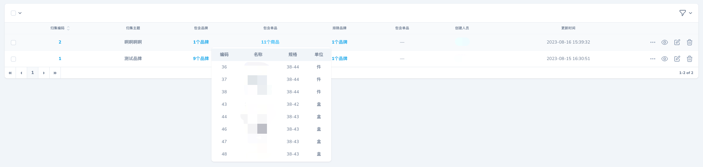
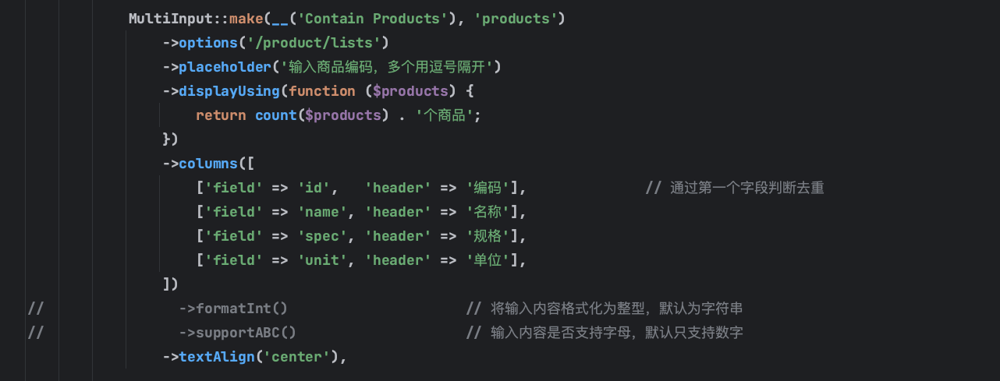
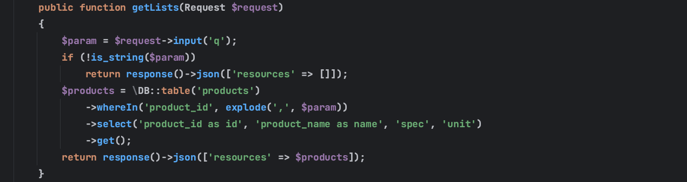

### Features

- A multi-input field for Laravel Nova.
- Also supports dark mode.

### Screenshots




### Installation

Install this package in a Laravel Nova project via Composer:

```bash
composer require jshxl/multi-input
```

### Requirements

- `php: ^8.1`
- `laravel/framework: ^10.10`
- `laravel/nova: ~4.0`
- `jshxl/primevue: ^1.3.3`

### Documents

- demo



- responses



I'm lazy, so I don't want to write documents. You can read the source code to understand how to use it.

### License

This project is open-sourced software licensed under the MIT license.
